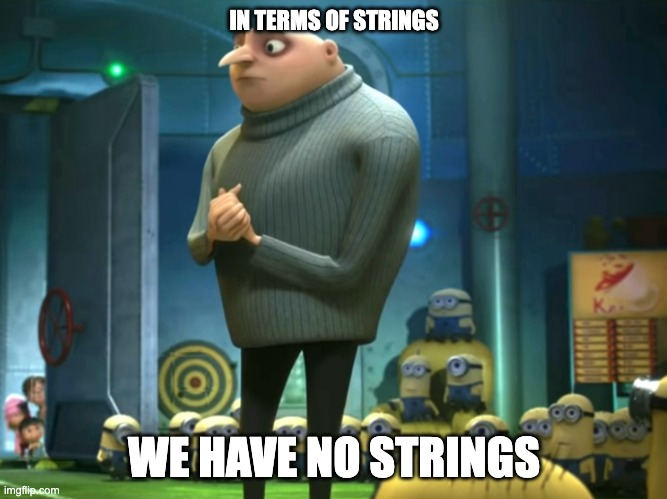

# Why C?
As electronic engineers, or engineers in general, you will likely be working with embedded system.
Embedded systems are, for example, your smartphone or your Amazon Alexa, but also your smart light bulb or
the control system for an oil refinery. As you might be aware, the platform code for your smartphone, that is the user interface and all the frameworks that work behind the scenes so that you can share pictures on 
instagram, are most likely written in higher level languages such as Java, Kotlin or Swift. So why is it important for you to know how to prorgam in C? Withouth C, you would not be able to execute code written in those languages. The C language is extensively used in kernel programming. The kernel is the layer that handles all interactions between the operative system and the hardware itself. Another reason why you need
to be able to program in C as an engineer is that microcontrollers commonly used in the industry perform best when executing C binaries.

As you learnt last year, you could program the microbit using a python interpreter. However, you should have seen a significant computing and memory performance increase by using the C++ hardware abstraction layer.

# When no to use C
Theoretically you could do everything in C as you have control over the ins and outs of the computer. However, in 2022 you probably don't want to do that for ease of development. If you are developing a desktop application, it would make little sense to use C over a higher language as the complexity of the code would be way higher slowing down the development. The takeaway is, you should learn C but you should also be familiar with Java and friends.

# Hello world
I'm sure most of you will be familiar with the following code but I'll let you all have a quick referesher.
```c
// ./code/hello_world.c

#include <stdio.h>

int main(int argc, char **argv) {
    printf("Hello World!\n");
    return 0;
}
```
Explain code here

This is great, but how do we run this now? C is a compiled language, so you are going to need a compiler. I would suggest you use either gcc or clang as they are industry standard, but if you are asked by your lecturer to use something else you should probably stick to that or at least verify your code expresses the same behaviour when using their compiler of choice for assessment's sake. Throughout this presentation I will be using clang as it comes bundled with macOS. And as you can probably tell from this statement, what compiler you use realistically completely depends on what you are working on. Most often than not when developing for embedded system, you will be using cross-compiling toolchains. That is because the architecture of an embedded system is most likely different from the x86 architecture powering your machine. The most common embedded architecture is the ARM architecture but there are alternatives such as RISC-V and the Harvard architecture (most old arduino boards).

# What does the copiler do?
When it comes to programming we often refer to "the compiler" as a whole without going too much into details. Generating an execuitable actually comprises two steps. Creating object files and linking said object files. The compiler is only responsible for creating the object files. Object files are a translation into machine language from our source file. As you all know, computers don't understand english but they work quite well with bits. Once the compiler has produced the object files, we need to invoke the linker. The linker, as the name says, instructs the computer about what functions need to be invoked and where do they come from. In the example above we cann the printf function. Although our code does not define the printf function and does not instruct the computer about what the printf function does, the program still works. That is because we included the function definition from the standard input and output library, that is stdio.h, and the linker has worked its way to reference the function call in our executable file.
Given that we are working with a somewhat low level language, you might want to inspect the intermediate steps that get you from your source C file to the executable binary file. A useful piece of information would come right before the assembler runs. The assembler translates assembly language into a binary executable. Assembly is the closes language to machine language. In assembly you have to describe what you want from the processor step by step. To gather the assembly code generated from your C file, compilers often expose a flag. In clang's and gcc's case that is `-S`. So, to get the assembly translation of your source code you should run something along the lines of: 

`$ clang -S -o code/hello_world-arm.asm code/hello_world.c`

```ts
// ./code/hello_world-arm64.asm

	.section	__TEXT,__text,regular,pure_instructions
	.build_version macos, 12, 0	sdk_version 12, 3
	.globl	_main                           ; -- Begin function main
	.p2align	2
_main:                                  ; @main
	.cfi_startproc
; %bb.0:
	sub	sp, sp, #48
	stp	x29, x30, [sp, #32]             ; 16-byte Folded Spill
	add	x29, sp, #32
	.cfi_def_cfa w29, 16
	.cfi_offset w30, -8
	.cfi_offset w29, -16
	mov	w8, #0
	str	w8, [sp, #12]                   ; 4-byte Folded Spill
	stur	wzr, [x29, #-4]
	stur	w0, [x29, #-8]
	str	x1, [sp, #16]
	adrp	x0, l_.str@PAGE
	add	x0, x0, l_.str@PAGEOFF
	bl	_printf
	ldr	w0, [sp, #12]                   ; 4-byte Folded Reload
	ldp	x29, x30, [sp, #32]             ; 16-byte Folded Reload
	add	sp, sp, #48
	ret
	.cfi_endproc
                                        ; -- End function
	.section	__TEXT,__cstring,cstring_literals
l_.str:                                 ; @.str
	.asciz	"Hello World!\n"

.subsections_via_symbols

```
```ts
// ./code/hello_world-x86_64.asm

.LC0:
        .string "Hello World!"
main:
        push    rbp
        mov     rbp, rsp
        sub     rsp, 16
        mov     DWORD PTR [rbp-4], edi
        mov     QWORD PTR [rbp-16], rsi
        mov     edi, OFFSET FLAT:.LC0
        call    puts
        mov     eax, 0
        leave
        ret
```


# Strings
So,

Or better, we treat strings in a different way from most programming languages. As humans, it's easy to think of a string as a collection of characters

# The most fascinating thing you can do in C
In my opinion, the most interesting thing you can do in C is memory manipulation. But what is memory? Modern systems have all sorts of memory right? You have storage, you have cache, random access memory (RAM), non volatile random access memory (NVRAM), video random access memory (VRAM) and the list goes on. 