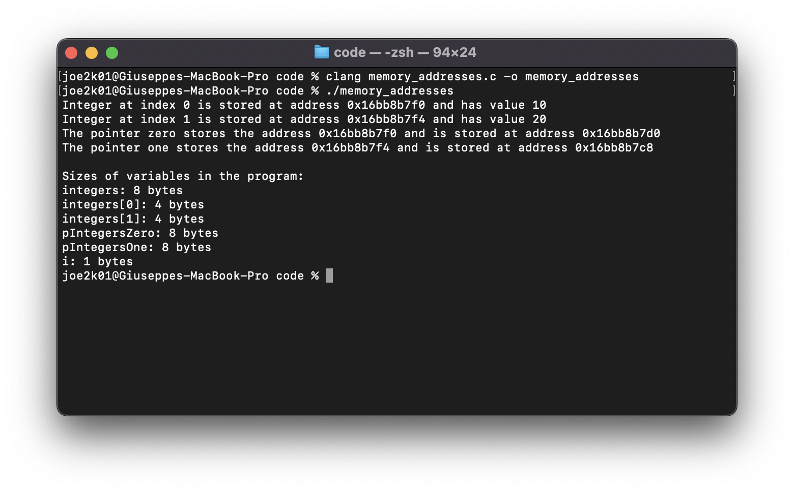
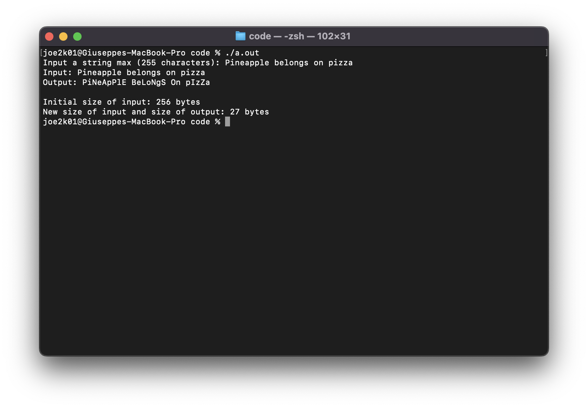

# Why C?

As electronic engineers or engineers in general, you will likely be working with embedded systems.
Embedded systems range from your smartphone to your Alexa, and from your smart light bulb to the control systems for the power grid.

As you might be aware, the top-level platform code for your smartphone, that is the user interface and all the frameworks that work behind the scenes so that you can share pictures on Instagram, are most likely written in higher-level languages such as Java, Kotlin or Swift. So why is it important for you to know how to program in C? Without C, you would not be able to execute code written in those languages. The C language is extensively used in things like kernel programming (the kernel is the layer that handles all interactions between the operative system and the hardware itself).

Another reason why you need to be able to program in C as an engineer is that common industrial microcontrollers are best programmed with C due to manufacturer libraries being provided only in C or for performance reasons.
As you may have learnt last year, you could program the microbit using a python. However, you should have noticed a significant computing and memory performance increase by using the available C++ hardware abstraction layer.
# Why not C?
You could, of course, do everything in C as you have control over the ins and outs of the platform. However, you probably don't want to do that for ease of development; If you are developing, say, a mobile app, it often makes little sense to use C over a higher language as the complexity of the code can be much higher which can often increase development time.
The takeaway from this is that you should learn C but you should also be familiar with newer languages such as C++, Java, e.t.c.

# Hello world

I'm sure most of you will be familiar with the following code but for those who aren't, here's a quick refresher:

```c
// ./code/hello_world.c

#include <stdio.h>

int main(int argc, char **argv) {
    printf("Hello World!\n");
    return 0;
}
```

- The first statement `#include <stdio.h>` allows us to use the Standard Input/Output library; since C itself does not provide IO functions, instead specifying a set of standard libraries that a platform should supply, we need this library to be able to print to the console.
- The second statement `int main(int argc, char **argv)` declares our so-called *main* function; most C toolchains expect this function to be the start of our code. The bits inside the brackets are our function *parameters* - in this case they contain the arguments that the user has given to the program on the command line (argv) along with the number of arguments (argc).
- The third statement `printf("Hello World!\n");` *calls* the library function `printf` with a single parameter, the string-literal **"Hello World!\n"**. This causes **Hello World!** to be printed to the console, along with a new-line (the `\n`).
- The final statement `return 0;` exits our program. The `0` tells the caller, user, or operating system that our program has not encountered any errors whilst a non-zero number here indicates an error - on certain operating systems such as the BSD systems ([macOS](https://developer.apple.com/library/archive/documentation/System/Conceptual/ManPages_iPhoneOS/man3/sysexits.3.html), [FreeBSD](https://www.freebsd.org/cgi/man.cgi?query=sysexits&apropos=0&sektion=0&manpath=FreeBSD+13.1-RELEASE&arch=default&format=html), OpenBSD, NetBSD) these numbers are standardised in a system library.

This is great, but how do we run this now?

C is a compiled language, so you are going to need a compiler. The usual suspects are GCC and Clang, with most vendors building their own tools off of one of these two. Throughout this presentation I will be using Clang as it comes bundled with Xcode. As you can probably tell from this point, what compiler you use often depends on what platform you are working with. When developing for an embedded system, you will be using cross-compiling toolchains. That is because the architecture and operating system (or lack of) of the embedded target is most likely different from the architecture and OS of your development machine.

The most common embedded architecture is the ARM architecture (in Thumb-mode, usually) but there are also common alternatives such as PIC (used in the popular PIC-16 chips), MIPS (used in the PIC-32 range), AVR (used by most Arduinos), PowerPC (used in Automotive, Aerospace, and Defence applications), MSP430 (used in your open-day spinner), e.t.c.

# What does the compiler do?

When it comes to programming we often refer to "the compiler" as a whole without going too much into details.
Generating an executable actually comprises at least two steps. Creating object files and then linking the object files. The compiler is only responsible for creating the object files, which are a translation into machine language from our source file.
As you all know, computers don't understand English but they do work quite well with bits and bytes.


Once the compiler has produced the object files, we need to call the linker. The linker, as the name says, instructs the computer about what functions need to be invoked and where they come from. In the example above we can the printf function. Although our code does not define the printf function and does not instruct the computer about what the printf function does, the program still works. That is because we included the function definition from the standard input and output library, that is stdio.h, and the linker has worked its way to reference the function call in our executable file.
Given that we are working with a somewhat low-level language, you might want to inspect the intermediate steps that get you from your source C file to the executable binary file. A useful piece of information would come right before the assembler runs. The assembler translates assembly language into a binary executable. Assembly is the closes language to machine language. In assembly, you have to describe what you want from the processor step by step. To gather the assembly code generated from your C file, compilers often expose a flag. In Clang and GCC's case that is `-S`. So, to get the assembly translation of your source code you should run something along the lines of:

`$ clang -S -o code/hello_world-arm64.asm code/hello_world.c`

<table>
<tr>
<td> ARM assembly </td> <td> x86_64 assembly </td>
</tr>
<tr>
<td>

```ts
// ./code/hello_world-arm64.asm

	.section	__TEXT,__text,regular,pure_instructions
	.build_version macos, 12, 0	sdk_version 12, 3
	.globl	_main                           ; -- Begin function main
	.p2align	2
_main:                                  ; @main
	.cfi_startproc
; %bb.0:
	sub	sp, sp, #48
	stp	x29, x30, [sp, #32]             ; 16-byte Folded Spill
	add	x29, sp, #32
	.cfi_def_cfa w29, 16
	.cfi_offset w30, -8
	.cfi_offset w29, -16
	mov	w8, #0
	str	w8, [sp, #12]                   ; 4-byte Folded Spill
	stur	wzr, [x29, #-4]
	stur	w0, [x29, #-8]
	str	x1, [sp, #16]
	adrp	x0, l_.str@PAGE
	add	x0, x0, l_.str@PAGEOFF
	bl	_printf
	ldr	w0, [sp, #12]                   ; 4-byte Folded Reload
	ldp	x29, x30, [sp, #32]             ; 16-byte Folded Reload
	add	sp, sp, #48
	ret
	.cfi_endproc
                                        ; -- End function
	.section	__TEXT,__cstring,cstring_literals
l_.str:                                 ; @.str
	.asciz	"Hello World!\n"

.subsections_via_symbols

```

</td>
<td>

```ts
// ./code/hello_world-x86_64.asm

	.section	__TEXT,__text,regular,pure_instructions
	.build_version macos, 12, 0	sdk_version 12, 3
	.globl	_main                           ## -- Begin function main
	.p2align	4, 0x90
_main:                                  ## @main
	.cfi_startproc
## %bb.0:
	pushq	%rbp
	.cfi_def_cfa_offset 16
	.cfi_offset %rbp, -16
	movq	%rsp, %rbp
	.cfi_def_cfa_register %rbp
	subq	$16, %rsp
	movl	$0, -4(%rbp)
	movl	%edi, -8(%rbp)
	movq	%rsi, -16(%rbp)
	leaq	L_.str(%rip), %rdi
	movb	$0, %al
	callq	_printf
	xorl	%eax, %eax
	addq	$16, %rsp
	popq	%rbp
	retq
	.cfi_endproc
                                        ## -- End function
	.section	__TEXT,__cstring,cstring_literals
L_.str:                                 ## @.str
	.asciz	"Hello World!\n"

.subsections_via_symbols

```

</td>
</tr>
</table>

# Function prototypes

You might have heard the term function prototype as it is a crucial concept to grasp in C. The prototype of a function is the declaration of the function itself, which specifies the function's name and type signature, or return type. A function prototype never contains the body of the function.
Why do we need function prototypes? Function prototypes are used to make the compiler aware of our function before we define what the function does. That way, if in our program we reference our function before we define its body, the linker will know what to do with the particular function call since we provided a prototype.
Here is an example

```c
// ./code/prototype.c

#include <stdio.h>

int sum(int a, int b);

int main(int argc, char **argv) {

    int sumResult;

    sumResult = sum(10, 5);

    printf("%d\n", sumResult);
    return 0;
}

int sum(int a, int b) {
    return a + b;
}
```

# Pointers

Pointers are, without a doubt, one of the most common sources of confusion when it comes to C programming.
So, what is a pointer? What does it do and how do we use it?
As the name suggests, a pointer points; What to? It points to a location, or *address*, in memory.

Why is that useful? Well, thanks to pointers, we can pass variables *by reference* rather than *by value*. It might not be immediate to you now, but this feature allows us to write code that performs efficiently and at the same time is easy to ready.

How does passing by reference work? Well like I said, pointers point to a address in memory. Often, but not exclusively, that address is where a variable is stored. This means that, given we have a reference to said variable, we can access it across different **scopes** in our program (A scope could be a function, for instance) without having to make a copy.
This means that if we define a variable in say, *main*, and then call another function, *B*, by passing a pointer to the variable we can modify (*mutate*) and read the value of the variable from within that function B. If we passed the variable by value we would only be able to see the value of the variable without being able to mutate it.

## Passing by value

An example of passing a variable by value would be:

```c
// ./code/pass_by_value.c

#include <stdio.h>

void print_variable(int variable);

int main(int argc, char **argv) {
    int mainVariable;

    mainVariable = 10;

    print_variable(mainVariable);
    return 0;
}

void print_variable(int variable) {
    printf("%d\n", variable);
}
```

## Passing by reference

Now an example of passing a variable by reference:

```c
// ./code/pass_by_reference.c

#include <stdio.h>

void print_and_change_variable(int *variable);

int main(int argc, char **argv)
{
    int mainVariable;

    mainVariable = 20;

    print_and_change_variable(&mainVariable);

    printf("New value: %d\n", mainVariable);
    return 0;
}

void print_and_change_variable(int *variable)
{
    printf("%d\n", (*variable));
    printf("Changing the value\n");

    (*variable) = 15;
}
```

There is a lot going on there. So first of all let's learn how to recognise a pointer. Whenever you see the `*` symbol **after** a type definition, then that variable is going to contain a pointer, rather than a value. Example:

```c
int *iAmAPointer = NULL;
```
iAmAPointer is going to be a pointer to an Integer value, though it currently points at the `NULL` address.


But a pointer should point to something - it shouldn't be `NULL`. To get the address of a variable to give to a pointer-variable, we use the `&` symbol. Example:

```c
int iAmAValue;
int * iAmAPointer;

iAmAValue = 10;

iAmAPointer = &iAmAValue;
```

Now we want to access the value of the variable from the pointer. To do that, we *dereference* the pointer.

Now a bit of confusion might kick in. To dereference a pointer we use the `*` symbol. Unfortunately, that is the same character we use to declare a pointer. So, how do we tell the difference? Context. If you see a type (int, float, char, e.t.c.) right before the `*`, then we are declaring a pointer to a variable of that type. If you see `*` in front of a variable (such as `*iAmAPointer`), then we are dereferencing that variable as a pointer - and it better be a valid pointer or there'll be trouble! Example:

```c
int iAmAValue;
int iAmTheSameValue;
int * iAmAPointer;

iAmAValue = 10;

iAmAPointer = &iAmAValue;

iAmTheSameValue = (*iAmAPointer); /* Dereference the pointer */
```

```c
int iAmAValue;
int iAmTheSameValue;
int * iAmAPointer;

iAmAValue = 10;

iAmAPointer = &iAmAValue;

iAmTheSameValue = (*iAmAValue); /* error: invalid type argument of unary ‘*’ (have ‘int’) */
```


It is important to mention that a pointer is just a variable, except instead of storing a "human" value it stores another variable's memory address.

## Example of memory content with variables and pointers

So let's visualise pointers and variables:
Imagine the below table is the memory in your computer:

| Address (HEX) | Content | Code reference |
| ------------- | ------- | -------------- |
| 0x1000        | Garbage | Nothing yet    |
| ...           | ...     | ...            |
| 0x1008        | Garbage | Nothing yet    |
| ...           | ...     | ...            |
| 0x1100        | Garbage | Nothing yet    |
| ...           | ...     | ...            |
| 0x1104        | Garbage | Nothing yet    |

The dots in the table above symbolise all the addresses in between the ones in the table.

Let's now consider the following program:

```c
// ./code/memory_addresses.c

#include <stdio.h>
#include <stdint.h>

#define ARRAY_SIZE 2

int main(int argc, char const *argv[])
{
    int integers[ARRAY_SIZE];
    uint8_t i;
    int *pIntegersZero, *pIntegersOne;

    integers[0] = 10;
    integers[1] = 20;
    pIntegersZero = &integers[0];
    pIntegersOne = &integers[1];

    for(i = 0; i < ARRAY_SIZE; i++) {
        printf("Integer at index %u is stored at address %p and has value %d\n", i, &integers[i], integers[i]);
    }

    printf("The pointer zero stores the address %p and is stored at address %p\n", pIntegersZero, &pIntegersZero);
    printf("The pointer one stores the address %p and is stored at address %p\n", pIntegersOne, &pIntegersOne);

    printf("\nSizes of variables in the program:\n");
    printf("integers: %lu bytes\n", sizeof(integers));
    printf("integers[0]: %lu bytes\n", sizeof(integers[0]));
    printf("integers[1]: %lu bytes\n", sizeof(integers[1]));
    printf("pIntegersZero: %lu bytes\n", sizeof(pIntegersZero));
    printf("pIntegersOne: %lu bytes\n", sizeof(pIntegersOne));
    printf("i: %lu bytes\n", sizeof(i));
    return 0;
}

```

By analysing the program we can predict what's going to happen with our memory.

```c
// ./code/memory_addresses.c#L1-L11

#include <stdio.h>
#include <stdint.h>

#define ARRAY_SIZE 2

int main(int argc, char const *argv[])
{
    int integers[ARRAY_SIZE];
    uint8_t i;
    int *pIntegersZero, *pIntegersOne;
```

Here we can see we have four variables. On most [modern non-embedded platforms](https://www.freebsd.org/cgi/man.cgi?query=arch&manpath=FreeBSD+12-current), integers are 4 bytes wide (Remember also that one byte is made of 8 bits). Next, we have the variable `i`. You should notice something odd here. `i` is not just an integer. I used the `uint8_t` type to define our variable, which as the name suggests is 8 bits, or 1 byte, long. I used this explicitly-sized type it's because I knew its value would never need to be greater than 255 ($2^8 - 1 = 255$). Hence, we saved some space in memory. This can certainly be a useful concept for embedded systems development.

Now we have two pointers. On a 64-bit platform pointers are usually 8 bytes long (or 64 bits).

Notice anything yet? My machine is a 64-bit ARM computer. The fact that pointers are 8 bytes long tells us that my machine can handle 64-bit address spaces. On a 32-bit Intel computer, pointers are usually 4 bytes long as they operate in 32-bit address spaces. So let's rewrite the table with our variables in mind:

| Address (HEX) | Content | Code reference  |
| ------------- | ------- | --------------- |
| 0x1000        | Garbage | `pIntegersZero` |
| 0x1008        | Garbage | `pIntegersOne`  |
| ...           | ...     | ...             |
| 0x1100        | Garbage | `integers[0]`   |
| 0x1104        | Garbage | `integers[1]`   |

Array items are stored consequently in memory. Therefore we can tell for sure that `integers[1]` is going to be stored 4 bytes after `integers[0]` because `integers[0]` itself is going to occupy 4 bytes in memory. Each address usually symbolises one byte, but this is implementation-defined and can, amongst other things, depend on the size of each type we are using. The same logic applies to our pointers. They are 8 bytes long and they are probably going to be in adjacent addresses. Since there is not a lot else going on in the program, it makes sense for our computer to organise the memory as it is displayed in the table.

The content of all those addresses before we assign a value to those variables is unknown and probably rubbish. It's rubbish because they store whatever value was in there before we execute our code. It could be nothing, or it could be anything. We don't know and it generally does not matter to us unless we try to access that memory before assigning some value. If we do that, we can't know what to expect.

```c
// ./code/memory_addresses.c#L12-L15

integers[0] = 10;
integers[1] = 20;
pIntegersZero = &integers[0];
pIntegersOne = &integers[1];
```

Once we run the program, we can expect something like this:

| Address (HEX) | Content | Code reference  |
| ------------- | ------- | --------------- |
| 0x1000        | 0x1100  | `pIntegersZero` |
| 0x1008        | 0x1104  | `pIntegersOne`  |
| ...           | ...     | ...             |
| 0x1100        | 10      | `integers[0]`   |
| 0x1104        | 20      | `integers[1]`   |

It should now be clear that a pointer is just a variable storing the address of another variable. To verify our claims, we can run the program and get a similar output to what I got here:


As you can see, the integers are 4 bytes apart, the pointers are 8 bytes apart and all the sizes check out to what was speculated before. The pointers point to the variables we intended them to point to. Do notice that the pointers are stored subsequently as we speculated. It might be trickier to catch but:

- `pIntegersOne` is stored at `0x16bb8b7c8`
- `pIntegersZero` is stored at `0x16bb8b7d0`
- `0x16bb8b7c8` is exaclty 8 bytes "before" `0x16bb8b7d0`
- In HEX, `0xC8 + 0x08 = 0xD0`

# Strings


Or better, we treat strings differently from most programming languages. As humans, it's easy to think of a string as a collection of characters. For example, we would normally associate `"Pugs are cute"` with the idea of a string. And that would be true in programming languages like Python where we can do stuff like:

```py
# ./code/str.py

def main():
    best_breed = "Pugs"
    print("The best breed is {}".format(best_breed))
    return 0


if __name__ == "__main__":
    main()

```

or Java:

```java
// ./code/Str.java

/* This uses Java's "default" package for example purposes only.
 * NEVER DO THIS!
 * Reason in short: https://stackoverflow.com/a/7849468
*/

public class Str {
    public static void main(String[] args) {
        String breed = "Pugs";
        System.out.println(String.format("The best breed is %s", breed));
    }
}
```

But hold on a second, in C you can do this for example:

```c
// ./code/dumb_str.c

#include <stdio.h>

#define CHARACTERS 5

int main(int argc, char const *argv[])
{
    u_int8_t i;
    char breed[CHARACTERS] = "Pugs";
    printf("The best breed is %s\n", breed);
    for(i = 0; i < CHARACTERS; i++) {
        if(breed[i] == '\0') {
            printf("%s is NULL terminated\n", breed);
        }
    }
    return 0;
}

```

So why is this bad? It isn't strictly speaking, but it's not very secure. First of all, as you might have noticed `breed` does not have some kind of string type since there is no string type in C. Strings are arrays of characters. Now, `"Pugs"` is made of `4` characters, yet I specified the length of the character array to be `5`. That is because strings must be "`NULL` terminated" in C. What does that mean? It means that the last character in a character array should have a value of `\0`.
Since there is no string type, your machine would have no notion of the length of the character array in use. Therefore, string manipulating functions often rely on the presence of the `NULL` character to determine where the string ends. In essence, a C string is a pointer to the first character in the array. So when you iterate over each item in the array, you know the string ends when you find a character with value `\0`. When a string value is assigned like in the above example, the compiler inserts the `NULL` character for you so you are somewhat safe. But let's say I spelled `"Pugs"` as `"Pugss"`, then we might encounter situations where our program crashes. What you could do to avoid this problem is not to specify the length of the array and the compiler will handle that for you:

```c
char* breed = "Pugs";
```

Generally speaking, using any of the above syntaxes is not ideal as they are invalid in ISO-C. In fact, in ISO-C variables, definitions, and declarations should happen at different times in the program. So what would be a better way to work with strings? To find that out, we first need to talk about dynamic memory allocation.

# `malloc()` and friends (dynamic memory allocation)

Everything we have done so far relies on *statically allocated* variables, but a true C ninja knows how to handle their dynamic memory. Here is where pointers come to shine. The main difference between *statically* and *dynamically* allocated memory (remember, variables sit in memory) is where and when the allocation happens.

## Static allocation

Statically allocated memory is allocated in what is called the *stack*, and it's allocated right at the beginning of your program staying allocated until your program exits. The stack is a region of memory allocated to the execution of your program. The ammount of memory available to the stack will not change throughout the execution of the program; Furthermore, once the size of the stack is determined and the memory is allocated, you will not be able to "free" the memory until the program exits. Freeing memory means making it available to other processes. Statically allocated memory is easy to use but gives you rather strict constraints.

## Dynamically allocated memory

Dynamically allocated memory is allocated into the so-called heap, and it's allocated upon request from your program. It can be freed whenever your program says it's okay to be freed. It should be clear to you that dynamic allocation gives you incredible degrees of freedom. On the other hand, dynamic allocation is often hard to keep track of and if done incorrectly can quickly lead to memory leaks. As with most things, dynamic allocation is better but harder to use.

So - how do we do this dynamic memory allocation thing?
```c
// ./code/malloc.c

#include <stdio.h>
#include <stdlib.h>

#define NOT_SO_DYNAMIC_LENGTH 10

int main(int argc, char const *argv[])
{
    int *dynamicArray;
    u_int8_t i;

    dynamicArray = malloc(NOT_SO_DYNAMIC_LENGTH * sizeof(int));

    for(i = 0; i < NOT_SO_DYNAMIC_LENGTH; i++) {
        dynamicArray[i] = NOT_SO_DYNAMIC_LENGTH - i;
    }

    for (i = 0; i < NOT_SO_DYNAMIC_LENGTH; i++)
    {
        printf("Integer at index %u has value %d\n", i, dynamicArray[i]);
    }

    free(dynamicArray);

    return 0;
}

```

In the above program we used the `malloc()` function from the Standard Library to dynamically allocate enough memory to store `10 * (NOT_SO_DYNAMIC_LENGTH)` integers. Integers because we specified `NOT_SO_DYNAMIC_LENGTH` (10, here) times the size of an integer (`sizeof(integer)`). We can do that with every type. At the end of the program, we released (or *freed*) the memory by calling the `free()` function and passing our pointer as a parameter. We used dynamic allocation but we did not really take any advantage of it, since we used a statically defined size. Let's now take advantage of dynamic allocation:
```c
// ./code/memory_operations.c

#include <stdio.h>
#include <stdlib.h>
#include <string.h>
#include <ctype.h>

#define BUFFER_SIZE 256

int bail();

int main(int argc, char const *argv[])
{
    char *buffer, *spongebobString;
    uint8_t i;
    size_t inputLength, inputSize, newSize;

    inputSize = BUFFER_SIZE * sizeof(char);
    buffer = malloc(inputSize);
    // Memory allocation can fail! (Extremely unlikely, but always better safe than sorry)
    if (buffer != NULL)
    {
        printf("Input a string max (%d characters): ", (BUFFER_SIZE - 1));
        fgets(buffer, BUFFER_SIZE, stdin);

        inputLength = strlen(buffer);

        // Remove new line at end of string
        inputLength--;
        buffer[inputLength] = '\0';
        newSize = ((inputLength + 1) * sizeof(char));

        buffer = realloc(buffer, newSize);
        spongebobString = malloc(newSize);
        if (buffer == NULL || spongebobString == NULL)
            return bail();

        memcpy(spongebobString, buffer, newSize);
        for (i = 0; i < inputLength; i += 2)
        {
            spongebobString[i] = toupper(spongebobString[i]);
        }

        printf("Input: %s\n", buffer);
        printf("Output: %s\n\n", spongebobString);
        printf("Initial size of input: %zu bytes\n", inputSize);
        printf("New size of input and size of output: %zu bytes\n", newSize);

        free(buffer);
        free(spongebobString);
    }
    else
    {
        return bail();
    }

    return 0;
}

int bail()
{
    printf("It appears this program is being run on a potato, bailing!\n");
    return -1; // Will "expand" to 255, return code is one byte
}
```
This program takes in an input string with a maximum length of `256` characters (each character is one byte) and returns a Spongebob meme style string (EvErY EvEn ChArAcThEr iS UpPeRcAsE). In this program we use a bunh of new functions.
 - `fgets` is used to receive input from the user.
 - `realloc` handles shrinking or expanding previously allocated memory (by `malloc`). It allows us to save some space as we allocate only the memory we actually need to store our string instead of the initial `256` bytes.
 - `memcpy` copies memory from one address to another. In this case we used it to duplicate our input string into a new buffer that we then modified.
 - `toupper` converts a character from lower case to uppercase. Can be done in many ways, this is easy and good enough for this example.

Program output:



As you can see, the allocated memory went from the initial `256` bytes to only `27` bytes.
